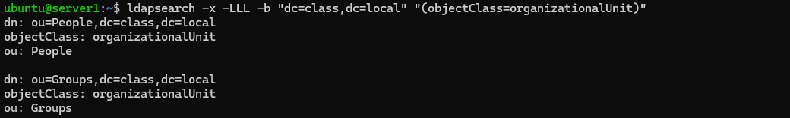
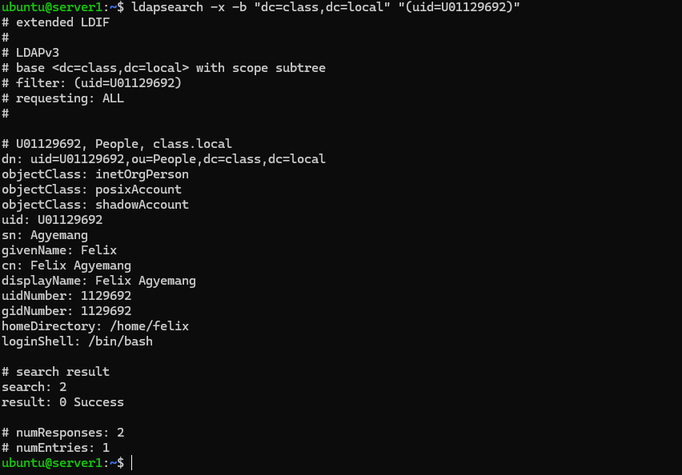
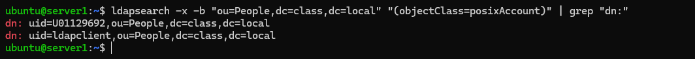

# Centralized Directory Management (OpenLDAP)

## Felix Owusu Agyemang

## 1. LDIF File Explanations

* **`structure.ldif`**: This file creates the Organizational Units (OUs) which serve as the directory's folder structure. I created a `People` OU for user accounts and a `Groups` OU for departmental organization.
* **`users.ldif`**: This file defines the individual user objects. It includes specific attributes like `uidNumber`, `gidNumber`, and `homeDirectory` so that the directory can be used for Linux system authentication.

---

## 2. Implementation Results

### Screenshot 1: Directory OUs
The output below confirms the successful creation of the **People** and **Groups** Organizational Units.

### Screenshot 2 and 3: User Verification
The output below shows my specific user account (`U01129692`) and an (`Idapclient`) user account successfully added and searchable within the directory.

---

## 3. Written Response

**Question:** If I delete a user from this LDAP server, why is that better than deleting them from five individual computers?

**Response:** Centralizing management on an LDAP server creates a single "source of truth." When a user is deleted from the server, their access is immediately and automatically revoked across all five connected computers. This is far more efficient than manual deletion and prevents security risks like "orphaned accounts" being left active on forgotten machines.

