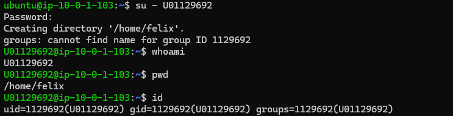

# Centralized LDAP Authentication

## Felix Owusu Agyemang

---

## 1. Verification Screenshots

### Screenshot 1: Visibility Check (`getent passwd U01129692`)


Proves the OS is pulling user data from the LDAP network.

---

### Screenshot 2: Identity Recognition (`id U01129692`)


Confirms the mapping of numerical IDs to the directory objects.

---

### Screenshot 3: Evidence of Successful Login



**Action:** `su - U01129692` followed by `whoami`,`pwd` and `id`

Displays the prompt change and the automatic creation of `/home/felix`.

---

## 2. Configuration Files
 
### `/etc/ldap/ldap.conf`
 
This configuration allows the LDAP utilities to point to the server and base DN.
 
```
BASE    dc=class,dc=local
URI     ldap://10.0.1.110
TLS_CACERT      /etc/ssl/certs/ca-certificates.crt
```
 
---
 
### `/etc/nsswitch.conf` (Relevant Lines)
 
This file dictates that the system should query the LDAP database for passwords, groups, and shadows after checking local files.
 
```
passwd:         files ldap
group:          files ldap
shadow:         files ldap
```
 
---
 
### `/etc/pam.d/common-auth` (Relevant Lines)
 
This file configures PAM to authenticate against LDAP after checking local Unix accounts. The `pam_ldap.so` line tells PAM to attempt LDAP authentication for any user with a UID of 1000 or above.
 
```
auth    [success=2 default=ignore]      pam_unix.so nullok
auth    [success=1 default=ignore]      pam_ldap.so minimum_uid=1000 use_first_pass
auth    requisite                       pam_deny.so
auth    required                        pam_permit.so
auth    optional                        pam_cap.so
```
 
---
 
## 3. Connectivity Verification (`ldapsearch`)
 
The following command was used to verify raw connectivity and directory structure:
 
**Command:**
```bash
ldapsearch -x -H ldap://10.0.1.110 -b "dc=class,dc=local"
```
 
**Result:**
```
result: 0 Success (numEntries: 7)
```
---

